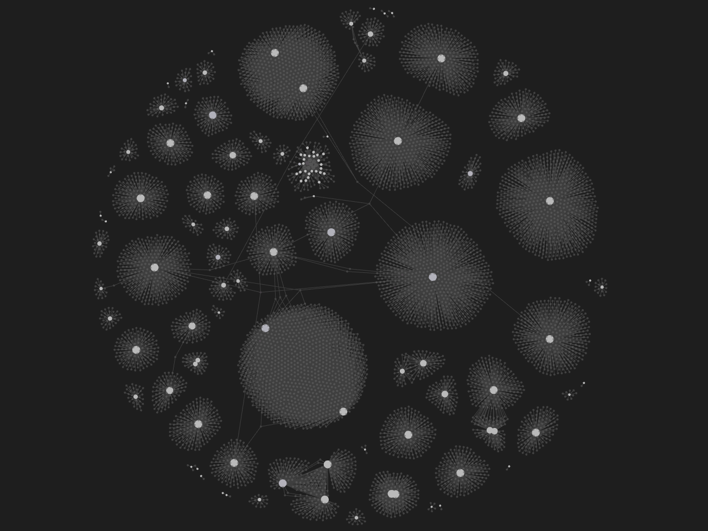

# MapOfInternet

- This program scrapes websites recursively and creates local markdown files for each website where each file contains all the links found on that website.
- ObsidianMD graph view can be used to visualise the links between all the websites in a graph.
- The website URLs had to formatted slightly before creating the markdown files, because they contain characters which are not allowed in Obsidian file names.

## Showcase Image

